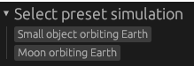
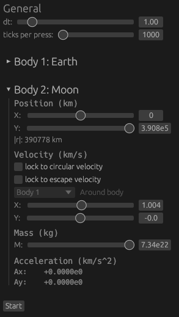

# gravi

2D orbital mechanics simulations, made with Rust.

Runs natively and compiles to WebAssembly to run in a browser.

## Usage
1. Select a preset in the top left.
  - 
2. Configure initial conditions further in the left panel.
  - 
3. Press the Start button to lock in initial conditions and start the simulation.
4. Press the right arrow to progress forwards.
5. Select another preset and start again.

#### Dependencies

Uses [`wgpu`](https://github.com/gfx-rs/wgpu) (graphics) + [`femtovg`](https://github.com/femtovg/femtovg) (2D vector drawing) + [`egui`](https://github.com/femtovg/femtovg) (UI).

Created from my boilerplate here: https://github.com/joshua-burbidge/femtovg-wgpu, which is adapted from the [femtovg examples](https://github.com/femtovg/femtovg/tree/master/examples).

#### WASM

To run this in a browser, run `./serve.sh` and open localhost:8000 (requires python).

#### TODO
- disable/don't render ui after starting to improve performance?
  - don't clear canvas?
- use types for units
- why is the frame time so low even when it's lagging
- Binary system - 2 equally-sized bodies
- performance gets worse when there are long trajectories
- show distance

#### Verify
- new energy implementation