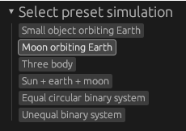

# gravi

2D orbital mechanics simulations, made with Rust.

## Usage
1. Select a preset in the top left.
  - 
2. Configure initial conditions further in the left panel.
  - 
3. Press the Start button to lock in initial conditions and start the simulation.
4. Press the right arrow to progress forwards.
5. Select another preset and start again.

#### Building and Running

To run natively: `cargo run`

To run in a browser with WebAssembly: `./serve.sh` then go to localhost:8000

#### Dependencies

Uses [`wgpu`](https://github.com/gfx-rs/wgpu) (graphics) + [`femtovg`](https://github.com/femtovg/femtovg) (2D vector drawing) + [`egui`](https://github.com/femtovg/femtovg) (UI).

#### Credits

Created from my femtovg+wgpu+egui boilerplate here: https://github.com/joshua-burbidge/femtovg-wgpu, which references the [femtovg examples](https://github.com/femtovg/femtovg/tree/master/examples) for femtovg integration and [egui-wgpu-demo](https://github.com/ejb004/egui-wgpu-demo) by [ejb004](https://github.com/ejb004) for the egui-wgpu integration.

#### TODO
- disable/don't render ui after starting to improve performance?
  - don't clear canvas?
- use types for units
- why is the frame time so low even when it's lagging
- recenter on preset
- big: hierarchical calculations for multi-body systems
  - add the circular velocities to the barycenter velocity, not to the other body's velocity 
- resonance
- panic in barycenters() if selecting a preset with fewer bodies

Performance gets worse when there are long trajectories
- a path of circles performs worse than a path of line_to (much worse)
- "run" function time stays mostly the same, "draw" increases with long trajectories
- in the "run" function the calculation is taking 10x more time than the rest

#### Verify
- new energy implementation

text disappears at smaller scales - when deployed, it only appears at large scales
- try increasing the scale
- scale == 0.05, font == 930 is visible

----------

WIP - hierarchy:
- want to use the bodies array before starting, then use the tree after starting
    - or update the bodies array after starting?

fix reset
barycenter names
barycenters should move correctly
shouldn't have to click refresh
refactor tree code
